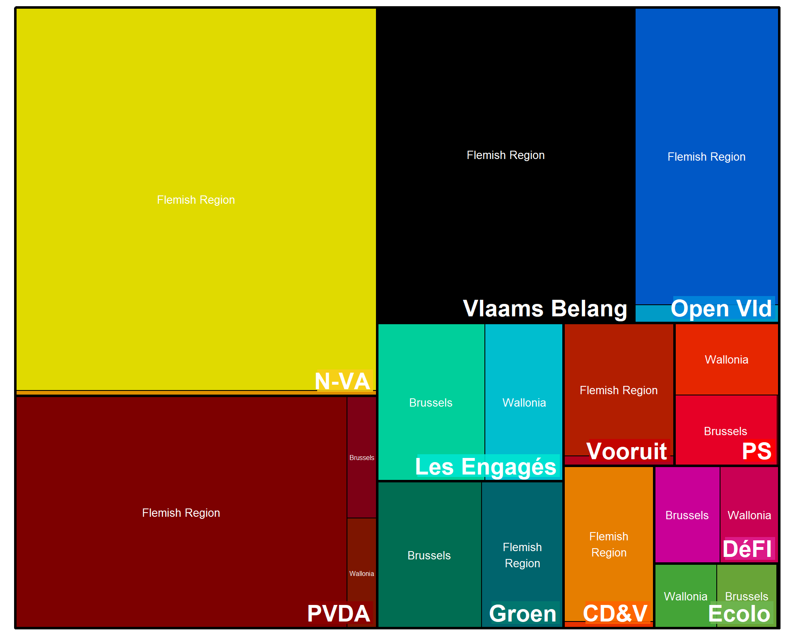
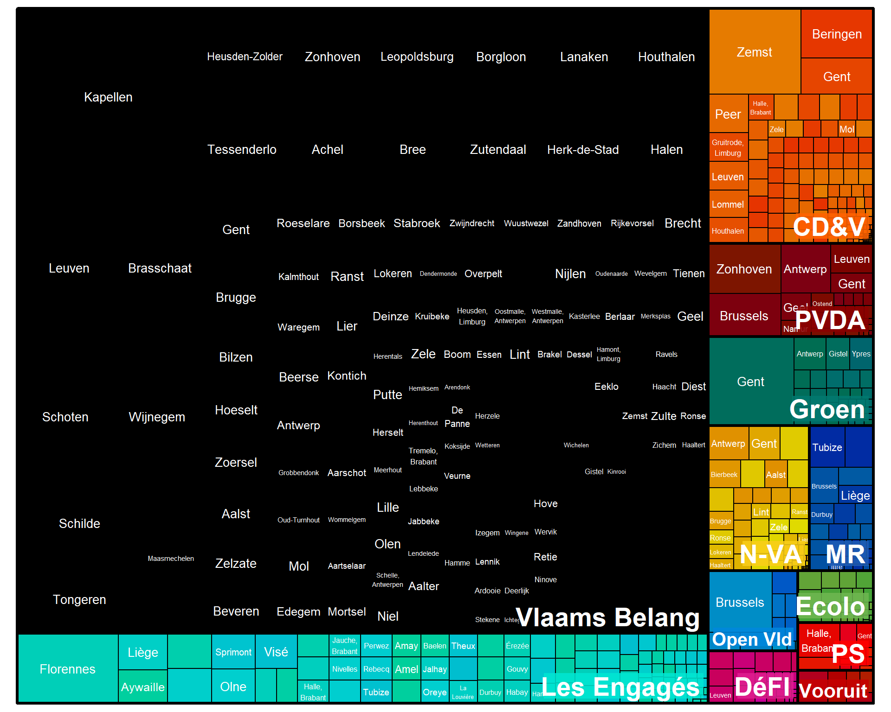
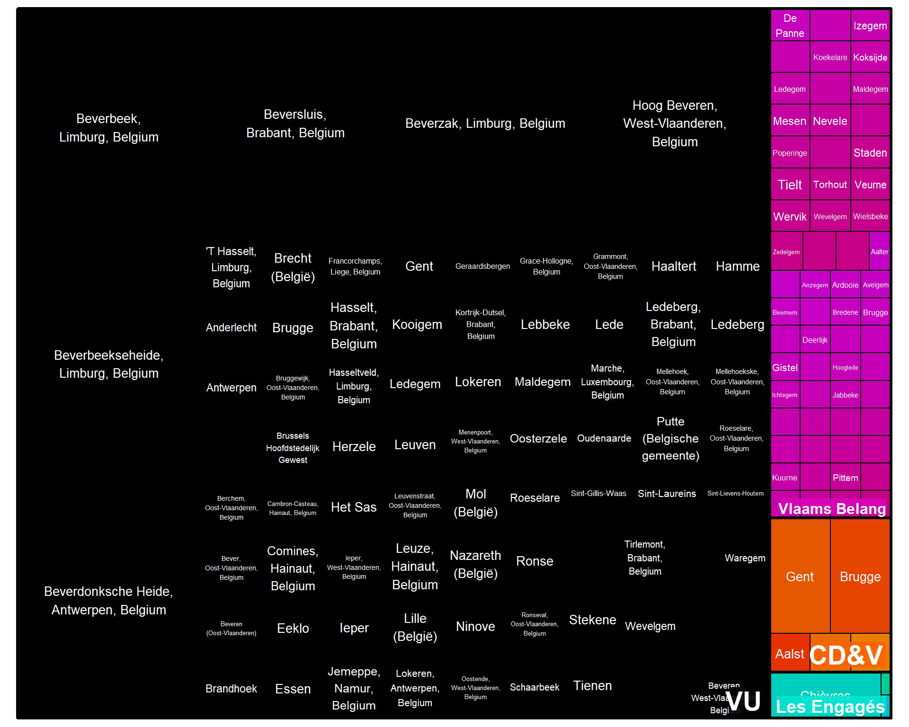
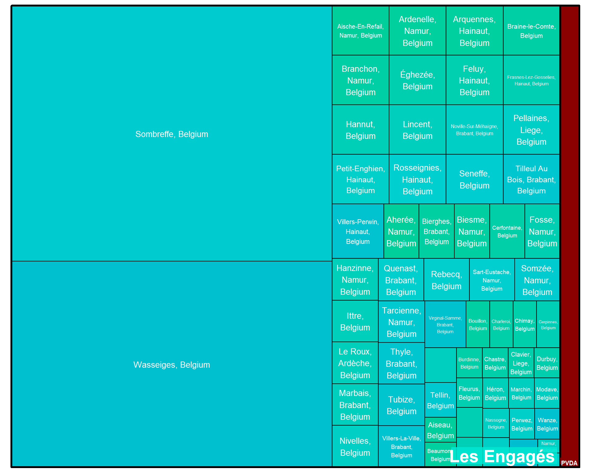

## Geographical Targeting

The chart below displays the geographical targeting of that political parties on Meta platforms.

::: {.panel-tabset}

### 26 okt - 24 nov 2023

::: {.panel-tabset}

#### Regions

> The size of each area in the chart indicates the amount of money spent by each political party on specific locations.

::: {.cell}
::: {.cell-output-display}
{width=960}
:::
:::

#### Cities

> The size of each area in the chart indicates the amount of money spent by each political party on specific locations.

::: {.cell}
::: {.cell-output-display}
{width=960}
:::
:::

:::

:::

## Geographical Exclusion

The following graphs depict the geographic locations that certain political advertisements will exclude on Meta, along with the amounts that parties spent on these exclusions.

::: {.panel-tabset}

### 26 okt - 24 nov 2023

::: {.panel-tabset}

#### Regions

> The size of each area in the chart indicates the amount of money spent by each political party on specific locations.

::: {.cell}
::: {.cell-output-display}
{width=960}
:::
:::

#### Cities

> The size of each area in the chart indicates the amount of money spent by each political party on specific locations.

::: {.cell}
::: {.cell-output-display}
{width=960}
:::
:::

:::

:::

